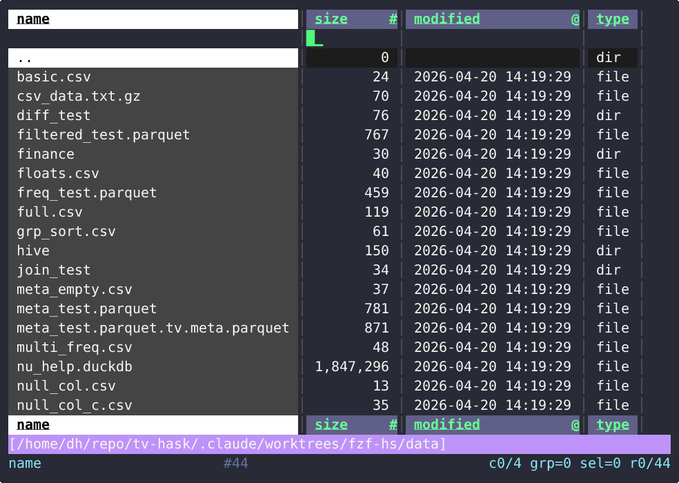
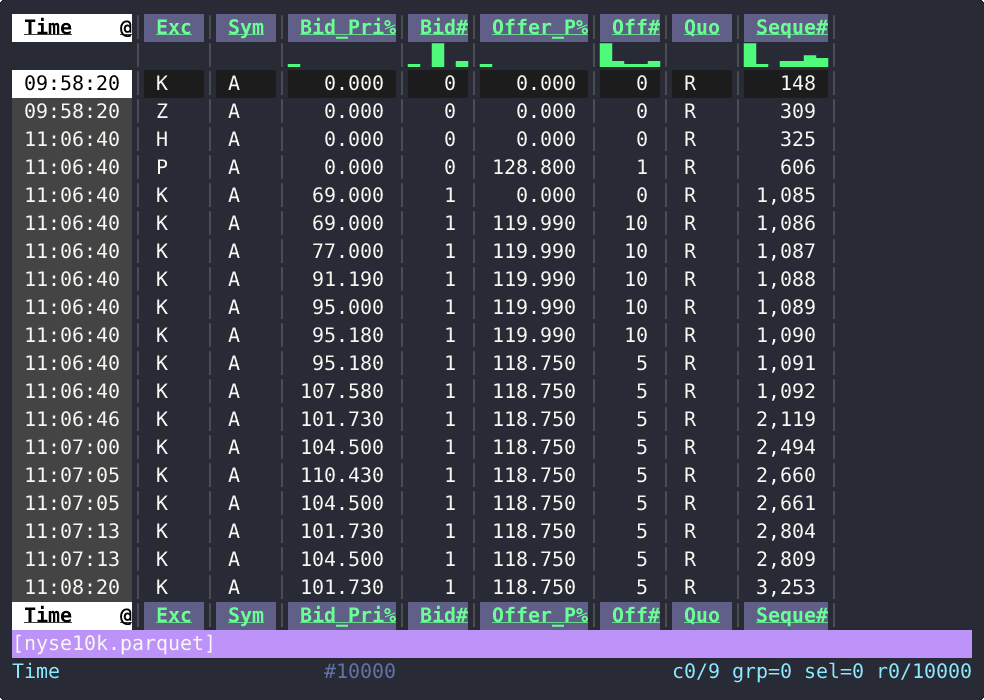
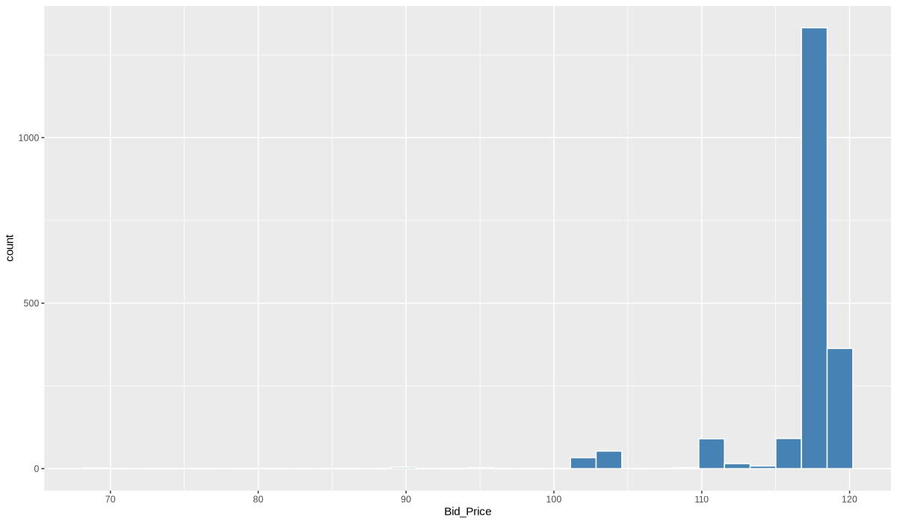
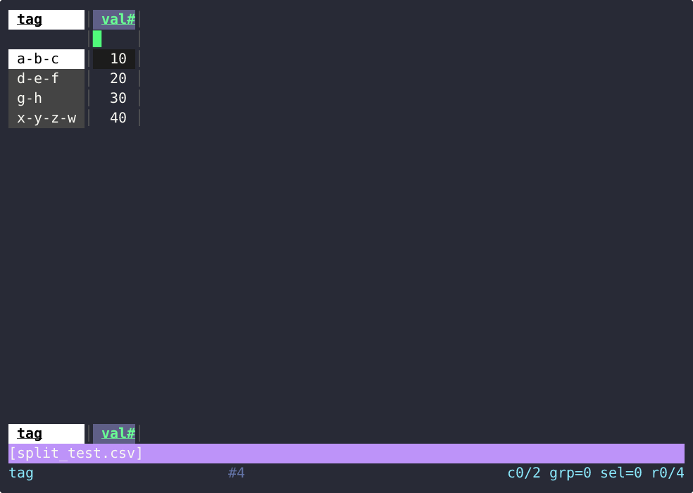
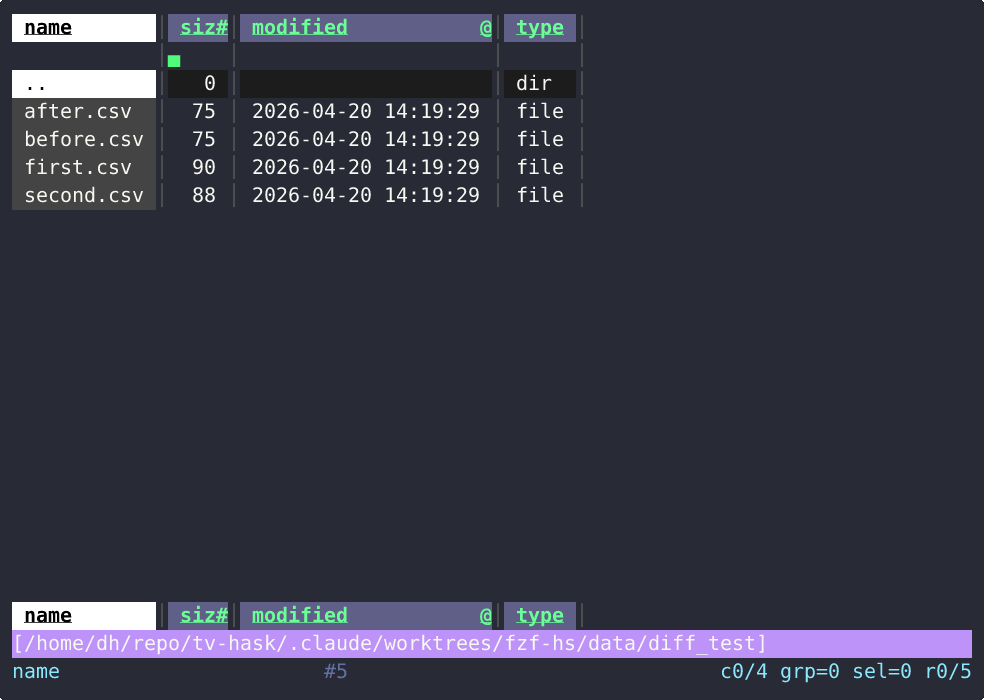

# tv - Terminal Table Viewer

VisiData-style terminal table viewer written in Haskell, with DuckDB backend.



## Features

tv opens CSV, Parquet, JSON, Arrow, DuckDB, SQLite, Excel, and gzip-compressed files.
It can also browse S3 buckets, HuggingFace datasets, FTP servers, Postgres databases,
and osquery tables.

### Folder browser

Point tv at a directory to browse files. Enter opens a file or subfolder,
Backspace goes to the parent, `[`/`]` sorts columns.


### Sparklines

Every column header shows a tiny sparkline of the value distribution.
You can see at a glance which columns are skewed, uniform, or sparse.



### Frequency view

Press `F` to see how many times each value appears in the current column.
Select a value and press Enter to filter the table to only those rows.


### Heatmap

Toggle heatmap coloring through the Space menu (`hea`).
Mode 1 colors numeric columns by value, mode 2 colors categorical columns,
mode 3 colors both.


### Plotting

Move the cursor to a numeric column, open the Space menu, and pick a plot type.
Charts are rendered with R/ggplot2 and displayed in the terminal.




### Command menu

Press Space to open a fuzzy-search command menu. Type to filter,
Enter to run. This is how you access most features.


### Column metadata

Press `M` to see every column's type, null count, and distinct values.
Press `0` to select columns with nulls, `1` for single-value columns,
then Enter to hide them from the main table.

Inside the meta view:

- `T` to select rows, then `S` computes mean / stddev / p25 / p50 / p75
  for the selected numeric columns (expensive aggregates, gated to the
  selection so the cost scales with what you care about, not table width)
- `C` on two or more selected numeric columns pushes a Pearson correlation
  matrix, auto-rendered with heat coloring so the gradient stands out


### EDA commands

Table-level exploratory-data primitives, each pushes a new view you can
pop back from with `q`:

| Key | Action |
|-----|--------|
| `?` | Random sample of 1000 rows (DuckDB reservoir sampler) |
| `u` | Duplicate rows — same tuple on group columns (or all cols if none grouped) |
| `P` | 2-way crosstab/pivot (requires exactly two grouped columns) |

### Sorting

Press `[` to sort the current column ascending, `]` for descending.


### Column split

Press `:` to split a column by a delimiter. Type the delimiter
(e.g. `-`) and press Enter. New columns appear for each part.



### Filter

Press `\` to open the PRQL filter prompt. Type an expression like
`Bid_Price > 100` and press Enter. Only matching rows remain.


### Derive column

Press `=` to create a computed column. Type an expression like
`Bid_Price * 2` and press Enter. The new column appears on the right.


### Table diff

To compare two tables, open the first file, press `S` to swap back to the
folder, open the second file, then press `V`. tv joins them on matching
columns and shows what changed. Identical columns are hidden, changed columns
get a `Δ` prefix.



### Remote sources

Browse S3 buckets (`tv s3://bucket/ +n`), HuggingFace datasets
(`tv hf://datasets/user/dataset`), and FTP servers (`tv ftp://ftp.nyse.com/`)
the same way you browse local folders.

### Also

- Column grouping with `!` (key columns pinned left, used as x-axis for plots)
- Row/column selection and hidden columns
- Status bar shows sum/avg/count for the current column
- Pipe mode: `cat data.csv | tv`
- Session save (`W`) and load (`L`)
- Tab line shows the PRQL pipeline; replay with `tv file -p "ops"`
- Socket control channel (`$TV_SOCK`) for scripting

## Install

No binary releases yet for this Haskell port — build from source below.
(The Lean [`Tc`](https://github.com/co-dh/Tc/releases) port, which this
tree is cast-for-cast compatible with, has static binaries if you want
to skip the toolchain.)

## Build from source

**Use `ghcup`, not your distro's `ghc` package.** On Arch Linux in
particular, pacman's `ghc` ships only dynamic interface files
(`.dyn_hi`) while cabal's source builds of Hackage deps default to
looking for static ones (`.hi`). That mismatch shows up as
`Could not find module 'Data.Hashable'` for packages that actually
built fine. `ghcup`'s toolchain lives under `~/.ghcup/`, contains both
flavors, and doesn't fight pacman's `haskell-*` packages.

Install the toolchain:

```bash
curl --proto '=https' --tlsv1.2 -sSf https://get-ghcup.haskell.org | sh
ghcup install ghc 9.6.6
ghcup install cabal
ghcup set ghc 9.6.6
```

Install system dependencies (see the [Dependencies](#dependencies)
section for the full list):

```bash
# Arch
sudo pacman -S r fzf findutils rustup unzip github-cli
rustup default stable
# Debian/Ubuntu: install rustc/cargo via rustup; gh from cli.github.com.
```

Clone and build:

```bash
git clone https://github.com/co-dh/tv-hask
cd tv-hask
make prqlc duckdb      # builds libprqlc_c.a + downloads duckdb static libs
cabal build all        # produces dist-newstyle/.../tv (~85 MB, fully self-contained)
cabal install          # copies tv to ~/.cabal/bin (add to $PATH)
```

`make duckdb` downloads the prebuilt `static-libs-linux-amd64.zip` from
the latest <https://github.com/duckdb/duckdb> release (~30 MB zip, ~135 MB
unpacked) and extracts it to `vendor/duckdb/`. No DuckDB source build
needed.

The `make prqlc` step clones <https://github.com/PRQL/prql> into
`vendor/prql/` and runs `cargo build --release` on the `prqlc-c` crate
(~40s on first build, cached after). To use a local PRQL checkout
instead, symlink it before running `make`:

```bash
ln -s ~/repo/prql vendor/prql && make prqlc
```

Run tests (169 tasty + 97 doctest):

```bash
cabal test
```

## Run

```bash
tv data.csv                        # CSV file
tv data.parquet                    # Parquet file
tv data.duckdb                     # DuckDB file (list tables)
tv .                               # Browse current directory
tv s3://bucket/prefix              # Browse S3 bucket
tv s3://bucket/path/file.csv       # Open S3 file directly
tv s3://bucket/prefix +n           # S3 public bucket (no credentials)
tv hf://datasets/user/dataset      # HuggingFace Hub dataset
tv ftp://ftp.nyse.com/             # Browse FTP server
tv osquery://                      # Browse osquery tables
tv osquery://processes             # Query osquery table directly
tv 'pg://host=/run/postgresql'     # Postgres DSN
cat data.csv | tv                  # Pipe mode (stdin)
tv -s mysession                    # Restore saved session
```

## Keybindings

### Navigation

| Key           | Action |
|---------------|--------|
| `j` / `↓`     | Down   |
| `k` / `↑`     | Up     |
| `h` / `←`     | Left   |
| `l` / `→`     | Right  |
| `PgDn` / `C-d` | Page down |
| `PgUp` / `C-u` | Page up |
| `Home`         | Top    |
| `End`          | Bottom |

### Views

| Key         | Action                                                           |
|-------------|------------------------------------------------------------------|
| `F`         | Frequency view (group by key + cursor column)                    |
| `M`         | Column metadata view                                             |
| `Enter`     | Enter (open file in folder, filter from freq, set key from meta) |
| `Backspace` | Go to parent directory (folder view)                             |
| `q`         | Pop view (quit if last)                                          |
| `X`         | Transpose (swap rows and columns)                                |
| `J`         | Join top 2 views (inner/left/right join, union, set diff)        |
| `d`         | Diff top 2 views (auto-key, hide same columns, Δ prefix diffs)  |
| `S`         | Swap top two views                                               |
| `D`         | Browse folder                                                    |
| `W`         | Save session (view stack to `~/.cache/tv/sessions/`)             |

### Selection and Grouping

| Key | Action |
|-----|--------|
| `T` | Toggle row selection |
| `!` | Toggle key column (group) |
| `Shift+←/→` | Reorder key columns (for join ordering) |
| `H` | Hide/unhide current column |
| `x` | Delete column(s) from query |

### Sorting and Transforms

| Key | Action |
|-----|--------|
| `[` | Sort ascending |
| `]` | Sort descending |
| `=` | Derive column (PRQL expression) |
| `:` | Split column by delimiter/regex |

### Search

| Key | Action |
|-----|--------|
| `/` | Search (fzf) |
| `n` | Next match |
| `N` | Previous match |
| `\` | Filter expression (PRQL) |
| `g` | Jump to column by name (fzf) |
| `Space` | Command palette (all commands with fuzzy search) |

### Meta View (M)

| Key     | Action                                     |
|---------|--------------------------------------------|
| `0`     | Select all-null columns                    |
| `1`     | Select single-value columns                |
| `Enter` | Set selected as key columns, pop to parent |

### Display

| Key | Action |
|-----|--------|
| `I` | Toggle info overlay (context-specific hints) |
| `{` / `}` | Scroll cell preview up/down |
| `e` | Export current view (csv/parquet/json/ndjson) |

Everything else (precision, width, themes, clipboard, heatmap, plots, session load) is accessible via `Space` command palette.

### Plot

Renders charts via R/ggplot2. Data is exported from DuckDB, downsampled if large, and rendered to PNG.

#### Setup

1. Group a column with `!` for the x-axis
2. Move cursor to a numeric column for y-axis
3. Open `Space` menu and pick a plot type (line, scatter, bar, boxplot, area, step, violin)

**Histogram/density** are exceptions — no group needed, just cursor on a numeric column.

#### Finance plots

Reachable from the `Space` menu as `plot.*`. All except `candle` take a
single numeric y-column (group a time column for x):

| Command | Shows |
|---------|-------|
| `plot.returns`  | Histogram of simple returns (y/lag(y) − 1) |
| `plot.cumret`   | Cumulative returns line, percent y-axis |
| `plot.drawdown` | Peak-to-trough filled curve (red, reversed y) |
| `plot.ma`       | Price line with a 20-period SMA overlay |
| `plot.vol`      | Rolling 20-period volatility (stddev of returns) |
| `plot.qq`       | Q-Q plot of y against normal quantiles |
| `plot.bb`       | Bollinger bands: SMA ± 2σ ribbon over price |
| `plot.candle`   | OHLC candlestick — group 5 cols in order: date, open, high, low, close |

A small synthetic OHLC fixture is at `data/finance/sample_ohlc.csv` (60
bars, generated by `scripts/gen_ohlc.py`); swap in real daily bars from
Stooq/Yahoo (same `Date,Open,High,Low,Close,Volume` schema).

Optional: group a 2nd column for color, 3rd for facets.

| Groups | X-axis | Color | Facet |
|--------|--------|-------|-------|
| 1 (`!`) | 1st group | — | — |
| 2 (`!!`) | 1st group | 2nd group | — |
| 3 (`!!!`) | 1st group | 3rd group | 2nd group |

#### Interactive controls

Once in plot view, keys control the chart in-place:

| Key | Action |
|-----|--------|
| `.`/`,` | Coarser/finer downsampling (shown only for large data) |
| `q` | Exit back to the table |

#### Display

Plot images are displayed using the best available method:

1. **Kitty graphics** (`kitten icat`) — pixel-perfect, works in kitty/WezTerm/ghostty
2. **viu** — half-block ANSI rendering, works in most terminals
3. **xdg-open** — opens in system image viewer

#### Requirements

Install R with ggplot2: `Rscript -e 'install.packages("ggplot2")'`

## Dependencies

Required:

| Tool   | Purpose                                    |
|--------|--------------------------------------------|
| `find` | Folder browsing (GNU findutils `-printf`)  |
| `fzf`  | Fuzzy search, column jump, command palette |

DuckDB and PRQL → SQL compilation are statically linked into the `tv`
binary at build time via FFI; no runtime dependency on `libduckdb.so`
or the `prqlc` CLI.

Build-time only:

| Tool       | Purpose                                                   |
|------------|-----------------------------------------------------------|
| `cargo`    | Builds `libprqlc_c.a` from the PRQL Rust crate            |
| `git`      | Clones the PRQL repo on first `make prqlc`                |
| `gh`       | Downloads the DuckDB static-libs release zip              |
| `unzip`    | Unpacks the DuckDB static-libs zip into `vendor/duckdb/`  |

Optional (feature-specific):

| Tool        | Feature                                | Fallback         |
|-------------|----------------------------------------|------------------|
| `Rscript`   | ggplot2 plot rendering                 | plot disabled    |
| `kitten`    | Kitty graphics protocol display        | `viu`            |
| `viu`       | Display plot PNG in terminal           | `xdg-open`       |
| `xdg-open`  | Open plot PNG in GUI viewer            | none             |
| `aws`       | S3 bucket browsing & download          | S3 disabled      |
| `trash-put` | Move files to trash (folder view)      | `gio trash`      |
| `gio`       | Move files to trash (GNOME)            | none             |
| `osqueryi`  | Osquery table browsing & queries       | osquery disabled |
| `tmux`      | fzf popup mode (`--tmux`)              | fullscreen fzf   |
| `socat`     | Socket preview in command palette      | preview disabled |

## Socket Command Channel

tv starts a Unix domain socket at `$TV_SOCK` (e.g. `/tmp/tv-12345.sock`).
External tools send handler names to control tv:

```bash
echo "heat.3" | socat - UNIX-CONNECT:$TV_SOCK          # heatmap: all columns
echo "sort.asc" | socat - UNIX-CONNECT:$TV_SOCK        # sort ascending
echo "nav.rowDec" | socat - UNIX-CONNECT:$TV_SOCK      # move cursor up
echo "split -" | socat - UNIX-CONNECT:$TV_SOCK          # split column by "-"
echo "derive d = x * 2" | socat - UNIX-CONNECT:$TV_SOCK # derive column
echo "filter.rowFilter Price > 100" | socat - UNIX-CONNECT:$TV_SOCK # filter
echo "filter.rowSearch NYSE" | socat - UNIX-CONNECT:$TV_SOCK        # search
```

| Format | Example | Meaning |
|--------|---------|---------|
| `handler` | `sort.asc`, `heat.3` | Run handler directly |
| `handler arg` | `split -` | Handler with argument |
| `filter.rowFilter expr` | `filter.rowFilter Price > 100` | Filter rows by PRQL expression |
| `filter.rowSearch value` | `filter.rowSearch NYSE` | Search for value in current column |
| `export fmt` | `export csv` | Export (csv/parquet/json/ndjson) |
| `join idx` | `join 0` | Join (0=inner, 1=left, 2=right, 3=union, 4=diff) |

The socket is per-process and cleaned up on exit.

## Demo GIFs

The demo GIFs in `doc/` are recorded via `doc/gen_demo.py` using asciinema
`.cast` files converted to GIF with
[agg](https://github.com/asciinema/agg). Features that need fzf for
free-text input (split, derive, filter) send commands via the socket
channel instead, because fzf's `--print-query` text return doesn't work in
pty recordings. Features that only need fzf for selection (folder search,
command menu) work fine — fzf display and index selection work in pty,
only typed-text return is broken.

## Architecture

See [doc/architecture.md](doc/architecture.md) for the main loop, module
layering, and invariants.

## Known Limitations

- Duration columns display as raw int64 (DuckDB ADBC limitation)
