# tv-hask Architecture

## Main loop

Every frame passes through this cycle. Dispatch lives in
[`Tv.App.Common.loopProg`](../src/Tv/App/Common.hs).

```mermaid
flowchart TD
    Render[doRender<br/><i>paint cell buffer,<br/>flush via Term.present</i>]
    NextKey[nextKey<br/><i>prod: pollEvent → toKey<br/>test: pop keystroke vector</i>]
    Poll[Socket.pollCmd<br/><i>drain CLI -c / socket IPC</i>]
    Lookup[CmdConfig.keyLookup<br/><i>&#40;key, viewKind&#41; → CmdInfo</i>]
    ReadArg[readArg<br/><i>prompt for filter expr,<br/>file path, …</i>]
    Dispatch[dispatch<br/><i>registry&#91;ciCmd&#93; runs HandlerFn</i>]
    Handler[HandlerFn<br/><i>canonical pure path:<br/>View.update cur cmd arg<br/>→ &#40;View', Effect&#41;</i>]
    Effect[runViewEffect<br/><i>interpret Effect in IO:<br/>Sort, Freq, Exclude, FetchMore, …</i>]
    Quit([Return final AppState])

    Render --> NextKey
    NextKey -- Nothing --> Quit
    NextKey -- Just key --> Poll
    Poll --> Lookup
    Lookup -- Nothing<br/>&#40;unbound key&#41; --> Render
    Lookup -- Just ci --> ReadArg
    ReadArg --> Dispatch
    Dispatch --> Handler
    Handler --> Effect
    Effect -- ActOk --> Render
    Effect -- ActQuit --> Quit
    Effect -- ActUnhandled<br/>&#40;revert state&#41; --> Render
```

Three operations are interpreter-swappable via the free monad
`Tv.AppF.AppM`: `doRender`, `nextKey`, `readArg`. Everything else is plain
`liftIO`. `App.Common` ships two interpreters (`prodInterp`, `testInterp`)
and the loop body is interpreter-agnostic.

### Pure core / IO shell

`View.update` and `Freq.update` are pure: they return `(State, Effect)`
where the state is already updated and `Effect` is a residual instruction.
`runViewEffect` is the only place that touches DuckDB / the filesystem.
This keeps the dispatch graph testable — `TestPure` exercises the state
transitions directly, without a DB or a terminal.

## Module layering

Each layer may import from itself or layers above; nothing imports
downward. Every module has an explicit export list.

```mermaid
graph TD
    classDef entry   fill:#fef3c7,stroke:#d97706,color:#111;
    classDef orch    fill:#e0f2fe,stroke:#0369a1,color:#111;
    classDef feature fill:#dcfce7,stroke:#15803d,color:#111;
    classDef view    fill:#ede9fe,stroke:#7c3aed,color:#111;
    classDef data    fill:#fce7f3,stroke:#be185d,color:#111;
    classDef leaf    fill:#f3f4f6,stroke:#4b5563,color:#111;

    ENTRY["<b>ENTRY</b><br/>app/Main.hs → Tv.App.Main"]:::entry
    ORCH["<b>ORCHESTRATION</b> &#40;the loop&#41;<br/>App.Main · App.Common · App.Types · AppF"]:::orch
    FEAT["<b>FEATURES</b> &#40;one per capability;<br/>each exports its own commands Vector&#41;<br/>Nav · Filter · Ops · Freq · Meta · Transpose · Diff<br/>Plot · Export · Session · Folder · StatusAgg · Sparkline<br/>FileFormat · Source · Ftp"]:::feature
    VIEW["<b>VIEW MODEL</b> &#40;pure, no IO&#41;<br/>View · CmdConfig · Theme · UI.Info · UI.Preview · Render"]:::view
    DATA["<b>DATA</b> &#40;only place allowed to build / execute SQL&#41;<br/>Data.DuckDB · Data.DuckDB.Conn · Data.DuckDB.Prql<br/>Data.DuckDB.Table · Data.DuckDB.Ops · Data.Text"]:::data
    LEAF["<b>LEAF</b> &#40;no internal Tv imports&#41;<br/>Types · Key · Term · Log · Tmp · Socket · Remote"]:::leaf

    ENTRY --> ORCH --> FEAT --> VIEW --> DATA --> LEAF
```

Highlights within each layer:

- **Orchestration** — `App.Common` holds the handler registry (a `Vector
  (Entry, Maybe HandlerFn)` built by concatenating each feature's own
  `commands`). `App.Types` owns `AppState` and `runViewEffect`. `AppF` is
  the free monad that splits prod vs test.
- **Features** — each module is one user-visible capability. Adding a
  feature is one `import` + one `commands` export — no central table to
  edit.
- **Sources** — `Tv.Source.*` is a further split of the Folder feature,
  one module per remote backend (`S3`, `HfRoot`, `HfDataset`, `Ftp`,
  `Rest`, `Osquery`, `Pg`). Each exports a 5-field `Source` record; see
  [the project-level rules](../CLAUDE.md#sources-are-per-module-closures).
- **Data** — the SQL boundary. PRQL goes in; rows come out. Feature
  modules call `Prql.pipe` + `Ops.*`; they never hand-write SELECTs.
- **Leaf** — pure utilities and the libterminal-ui FFI.

## Invariants

1. **PRQL-only for feature modules.** Feature modules never build SQL
   strings. They call `Tv.Data.DuckDB.Prql.pipe` to compose queries and
   `Tv.Data.DuckDB.Ops.{transposeSql, colAggSql, maxSplitParts,
   createTempView, createTempTable}` for the few cases PRQL can't express
   (UNPIVOT, per-column aggregates, temp view/table plumbing).

2. **Pure core, IO shell.** `View.update` / `Freq.update` return
   `(State, Effect)` — the state is already updated; the `Effect` is a
   residual instruction the IO shell (`App.Types.runViewEffect`) executes.
   This is what makes the dispatch graph testable without DuckDB.

3. **Two interpreters for one loop.** `Tv.AppF.AppM` is a free monad with
   three operations that differ test-vs-prod (`render`, `nextKey`,
   `readArg`). Everything else threads through `liftIO`. Production uses
   `Tv.Term` + `Tv.Socket`; tests use a keystroke vector + render-less
   interpreter.

4. **Handler registry by concatenation.** `App.Common.commands` is a
   plain `Vector (Entry, Maybe HandlerFn)` built from each feature
   module's own `commands` export. Adding a feature is a one-line concat,
   no central table to edit.
